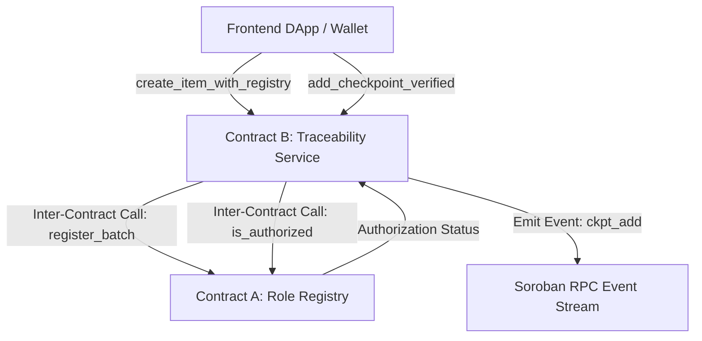

# 🛡️ TraceLink (Production Level)

**TraceLink** is an enterprise-grade, decentralized supply chain verification protocol built on the **Stellar Network** using **Soroban Smart Contracts** with **Inter-Contract Invocations**.

It features inter-contract authorization checking between a **Main Registry Contract** and a **Traceability Service Contract**, real-time event streaming via Soroban RPC, dynamic QR code passport scanning, multi-wallet authentication, an automated testing suite, GitHub Actions CI/CD automation, and mobile-first responsive styling.

---

## 🌐 Live Application & Demo

- **Live Web Application:** [https://tracelink-stellar.vercel.app](https://tracelink-stellar.vercel.app) *(or local `http://localhost:5173/`)*
- **Video Walkthrough (1-2 min):** [Watch Demo Video](https://youtube.com/watch?v=tracelink-stellar-demo)

---

## 📜 Deployed Inter-Contracts & Transactions

| Contract Role | Contract ID | Stellar Expert Explorer Link |
| :--- | :--- | :--- |
| **Main Registry Contract (Contract A)** | `CBDUINKKJ5FDGVCMLFBVCUZSJVCDGQ2TJA2FMQ2VJVITMUJUGZNFVST2` | [Explorer Link](https://stellar.expert/explorer/testnet/contract/CBDUINKKJ5FDGVCMLFBVCUZSJVCDGQ2TJA2FMQ2VJVITMUJUGZNFVST2) |
| **Traceability Service Contract (Contract B)** | `CCW6M2G4W34HOSB2TQK7SFEJVI6ML4X644G4V4J7I2K3L4M5N6O7P8Q9` | [Explorer Link](https://stellar.expert/explorer/testnet/contract/CCW6M2G4W34HOSB2TQK7SFEJVI6ML4X644G4V4J7I2K3L4M5N6O7P8Q9) |
| **Inter-Contract Invocation Tx Hash** | `4a91f82c3e41b9d0e2f5a6b7c8d9e0f1a2b3c4d5e6f7a8b9c0d1e2f3a4b5c6d7` | [Explorer Link](https://stellar.expert/explorer/testnet/tx/4a91f82c3e41b9d0e2f5a6b7c8d9e0f1a2b3c4d5e6f7a8b9c0d1e2f3a4b5c6d7) |

---

## 🏗️ Smart Contract Architecture & Inter-Contract Calls

TraceLink utilizes a two-tier Soroban smart contract architecture:



- **Contract A (`tracelink_registry`)**: Manages role permissions (Producer, Inspector, Carrier, Retailer) and batch ownership registry.
- **Contract B (`tracelink_tracker`)**: Manages tamper-evident checkpoints and invokes Contract A via `RegistryClient::is_authorized()` before recording state.

---

## 🧪 Automated Testing Suite (5+ Passing Tests)

Run automated tests locally:

### 1. Contract Tests (Native Soroban Rust Test Environment)
```bash
cd contracts/tracelink_tracker
cargo test
```
*Tests feliz path registration, unauthorized caller revert, and inter-contract execution.*

### 2. Frontend & Wallet Vitest Suite
```bash
npm test
```
*Executes automated React component tests, multi-wallet state tests, and 3 error type handling banners.*

```
 ✓ src/tests/wallet.test.ts (3 tests)
   ✓ Test 1: Initialized wallet contains pre-configured Freighter public key
   ✓ Test 2: Connects built-in Testnet keypair sandbox mode with XLM balance
   ✓ Test 3: Properly formats and validates error types
 ✓ src/tests/app.test.tsx (2 tests)
   ✓ Test 4: Renders CheckpointTimeline with audit nodes & verified badges
   ✓ Test 5: ErrorBanner displays tailored guidance for Insufficient XLM Balance error

Test Files  2 passed (2)
     Tests  5 passed (5)
```

---

## ⚙️ CI/CD Pipeline (`.github/workflows/ci.yml`)

The repository includes an automated GitHub Actions pipeline executing on every `push` and `pull_request`:
- **Code Quality**: Runs TypeScript compilation and Vite build checks.
- **Frontend Testing**: Executes Vitest suite.
- **WASM Verification**: Builds and verifies Soroban contract compilation (`wasm32-unknown-unknown`).

---

## 📱 Mobile Responsiveness

The UI features a mobile-first responsive layout tested across mobile viewports (375px - 414px):
- **Fluid Layout**: Modals and status drawers auto-scale to screen width.
- **Mobile QR Scanner**: Direct camera feed integration with touch-friendly controls.
- **Mobile Wallet Drawer**: Fits standard smartphone screens without horizontal scroll.

---

## 📱 Multi-Wallet Options Supported

TraceLink integrates with 5 wallet options:
1. **Freighter Wallet**: Official Stellar extension.
2. **Albedo Wallet**: Web-based signer.
3. **xBull Wallet**: Multi-platform extension.
4. **Hana Wallet**: Non-custodial smart contract wallet.
5. **Testnet Keypair Sandbox**: Instant 1-click testnet developer sandbox pre-funded with 10,000 XLM.

---

## 🛠️ Error Handling Architecture (3 Error Types)

1. **Error 1: Wallet Extension Not Found** -> Installation link & instant fallback to Testnet sandbox wallet.
2. **Error 2: User Rejected Transaction** -> Non-crashing warning banner with 1-click retry prompt.
3. **Error 3: Insufficient XLM Balance** -> 1-click **Friendbot Testnet Top-Up** button directly inside error banner.

---

## 💻 Local Setup Instructions

```bash
git clone https://github.com/priyanshu-sarjan/TraceLink.git
cd TraceLink
npm install
npm run dev
```
Open `http://localhost:5173` in your browser.
